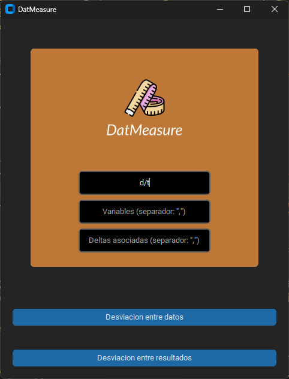
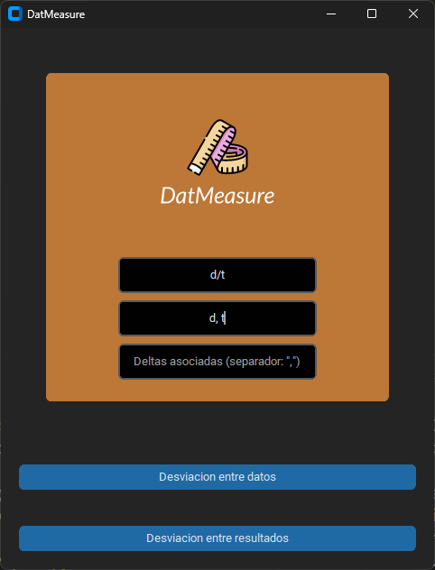
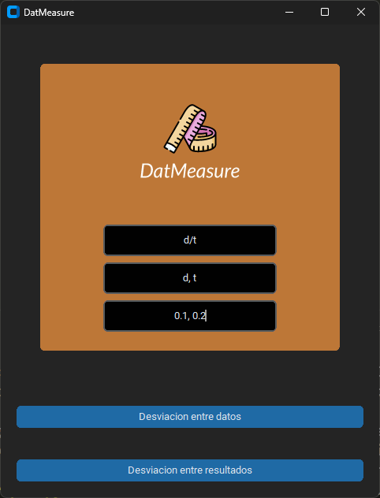
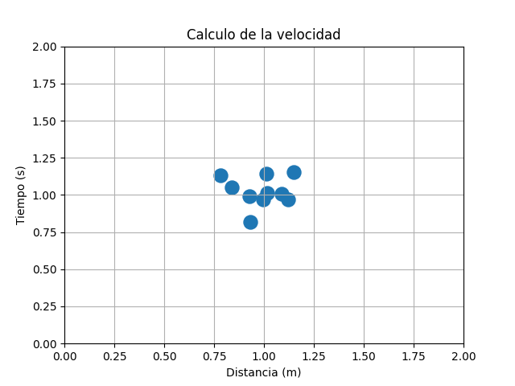
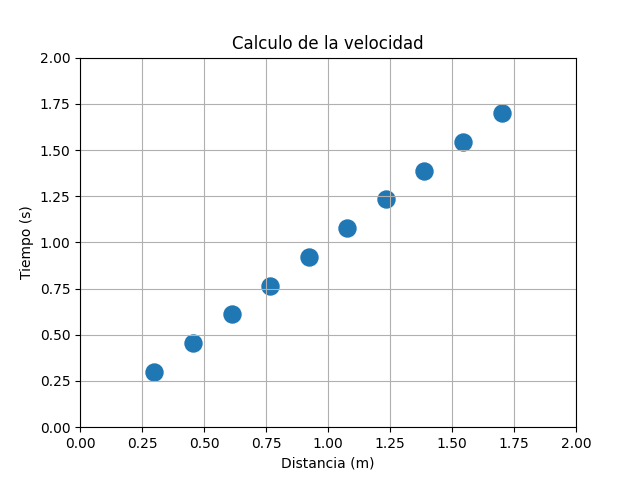
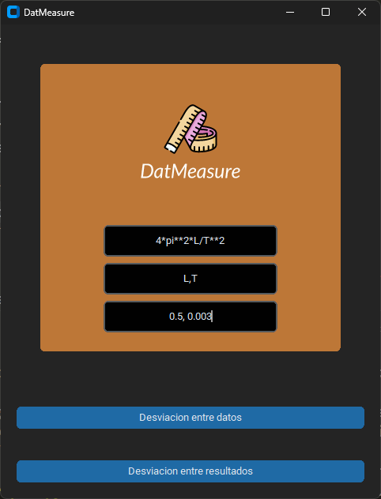

# DatMeasure

DatMeasure es una aplicación de código abierto, sirve como una herramienta auxiliar en los laboratorios de enseñanza de las licenciaturas de ciencias e ingenierías. Concretamente en las tareas relacionadas con el cálculo estadístico de las incertidumbres.

## ¿Cómo instalar la app?

Al descargar el archivo comprimido de la aplicación que se encuentra en "Releases", descomprímelo en la carpeta de tu preferencia. Busca el archivo "main.exe" y ejecútalo. Si tu computadora te dice que el archivo es peligroso, ignora la advertencia y ejecútalo de todas formas. Si tu computadora no te deja ejecutar el archivo, entonces tendrás que descargar el código fuente y ejecutarlo desde la terminal de Python.

## ¿Cuándo y cómo usar la app?

Cuando quieras calcular la incertidumbre de un conjunto de datos experimentales, de alguna medición directa o indirecta. Coloca en la casilla de "Expresión a derivar", la fórmula de la medición indirecta que necesites calcular. Por ejemplo, si quieres calcular la velocidad de un objeto usando la distancia y el tiempo, la fórmula sería $\frac{d}{t}$, por lo que tendrías que escribir "d/t" en la casilla de "Expresión a derivar".



En la casilla de "Variables" coloca las variables que usaste en la fórmula, separadas por comas. Por ejemplo, si usaste la distancia y el tiempo, tendrías que escribir "d,t" en la casilla de "Variables".



En la casilla "Deltas asociadas" coloca las incertidumbres de cada una de las variables, separadas por comas. Por ejemplo, si la incertidumbre de la distancia es de 0.1 y la del tiempo es de 0.2, tendrías que escribir "0.1,0.2" en la casilla de "Deltas asociadas".



Ahora dependiendo de la forma de tus datos es que vas a escoger si apretar el boton de "Desviación entre datos" o "Desviación entre resultados". Si tomaste varias mediciones de un mismo punto en tu espacio de variables, es decir, tus datos se ven como una nube de puntos, entonces aprieta el boton de "Desviación entre datos". Mismo ejemplo:



Si por el contrario, tomaste varias mediciones de diferentes puntos en tu espacio de variables, es decir, tus datos se ven como la trayectoria que describe tu expersión, entonces aprieta el boton de "Desviación entre resultados". Con el ejemplo de la velocidad:



Aparecerá una ventana emergente en donde podrás ingresar tus datos para la primer variable en la sección de "Datos" de nuevo separandolos por una coma, o podrás ingresar un archivo ".cvs" o ".xlsx" en donde el programa interpretará solamente la primer columna como los datos de la primer variable. Asegurate de poner una celda con el nombre de la variable al inicio de la columna.

Repite el paso anterior para las demás variables y listo el programa te dará el resultado de la medición indirecta con su incertidumbre.

## OPCIONES DISPONIBLES

* Módulo de funciones de Python.
* Aplicación descargable.
* Integración de archivos .xlsx (Excel).
* Integración de archivos .cvs

Las funciones que planeo agregar son:

* Opción de ingresar expresiones tipo $\LaTeX$
* ~~Un taco de bienvenida~~

## Cálculo de incertidumbres

¿Cómo es que voy a calcular las incertidumbres? La respuesta es simple, usando ésta fórmula:

$$
\Delta f(x_0, x_1, ...) = \Delta f(x_0,x_1,x_2,...) =  \sqrt{(\sigma_{nom})^2 + (\sigma_{est})^2}
$$

Donde $\sigma_{nom}$ representa la incertidumbre nominal de nuestra medición indirecta y donde $\sigma_{est}$ representa la incertidumbre estadística asociada a la función $f$.

La incertidumbre nominal y estadísiticas estarán calculadas de la siguiente manera:

$$
\sigma_{nom} = \sqrt{\sum_{i=0}^N (\frac{\partial f}{\partial x_i})^2 \sigma_{ap}^2}
$$

$$
\sigma_{est} = \sqrt{\sum_{i=0}^N (\frac{\partial f}{\partial x_i})^2 S_{x_i}^2}
$$

En donde $\sigma_{ap}$ representa la incertidumbre de apreciación, i.e. La incertidumbre debida a la resolución de nuestro instrumento de medición. $S_{x_i}$ Representa la desviación estandar asociada a cada una de las muestras tomadas de la variable $x_i$ Asumiendo una distribución normal.

Cabe aclarar que estamos tomando muchas restricciones, dado que estamos asumiendo que la parte no lineal de la función $f$ es no-significativa, y que puede ser despreciada en una expansión en serie de Taylor.

Espero poder actualizar y agregar más funciones en el futuro, por lo que la opción de calcular incertidumbres de funciones completamente no lineales eventualmente será agregada.

También cabe añadir que estamos reduciendo la incertidumbre absoluta dada por $\Delta f$ a la incertidumbre nominal y estadística, y aunque estricatmente esto es solo una parte de la misma, para propositos de enseñanza es más que suficiente.

## Más ejemplos

### Medición de la aceleración de la gravedad con un péndulo

Cuando queremoc calcular la gravedad de esa forma, la función que usamos para angulos pequeños sería:

$$
g = \frac{4\pi^2 L}{T^2}
$$

Donde $L$ es la longitud del péndulo y $T$ es el periodo de oscilación. La expresión que tendrías que poner en la app sería:

```none
4*pi**2*L/T**2
```

Si gustas puedes colocar paréntesis para hacerte más facil la lectura.


